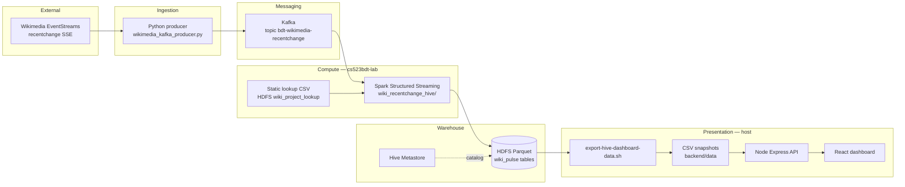

# System architecture

This document describes how the **Wiki Pulse** pipeline is structured: which components exist, how they connect, and where data lives at each stage. For step-by-step commands, see [`README.md`](../README.md).

## Design goals

- **Stream-first**: ingest a public Wikimedia SSE feed and publish a stable JSON contract to Kafka.
- **Stateful analytics**: Spark Structured Streaming windows events, applies watermarks, and aggregates metrics.
- **Durable warehouse sink**: Parquet-backed Hive tables under database `wiki_pulse` so results can be queried with Hive CLI.
- **Bonus enrichment**: a small static CSV in HDFS is broadcast-joined in Spark to attribute wikis to project families.
- **Simple dashboard path**: periodic Hive → CSV snapshots on disk, a thin Node/Express API, and a React UI (no HiveServer2 in the hot path).

## Logical architecture

## Layered view

| Layer | Responsibility | Primary artifacts |
|-------|----------------|-------------------|
| **Source** | Continuous `recentchange` events over HTTP (SSE). | Wikimedia EventStreams URL (configurable in producer). |
| **Ingestion** | Parse SSE, map to JSON contract, publish to Kafka with backoff/reconnect. | `producer/wikimedia_kafka_producer.py`, `scripts/run-producer-docker.sh` |
| **Messaging** | Durable, partitioned log for downstream consumers. | Topic `bdt-wikimedia-recentchange`; contract in `docs/kafka-message-contract.md` |
| **Stream processing** | Read Kafka as a stream, parse JSON, watermark, window, aggregate; optional broadcast join to static lookup. | `spark-streaming/wiki_recentchange_hive/`, `scripts/run-spark-streaming-hive.sh` |
| **Static enrichment (bonus)** | Dimension table for wiki → project family (and related columns). | `static-data/wiki_project_lookup.csv`, `scripts/upload-static-wiki-lookup.sh` |
| **Warehouse** | Managed tables pointing at HDFS locations; Spark appends Parquet files compatible with Hive. | `sql/hive/create_wiki_pulse_tables.sql`, DB `wiki_pulse` |
| **Serving** | Pollable files + REST JSON for the UI. | `scripts/export-hive-dashboard-data.sh`, `dashboard-react/backend`, `dashboard-react/frontend` |

## Data flow (one sentence per hop)

1. **SSE → producer**: Raw events become normalized messages on the Kafka topic.
2. **Kafka → Spark**: Micro-batches read topic payloads; structured fields drive aggregations.
3. **Spark → HDFS/Hive**: Each batch writes Parquet under the table locations defined in Hive DDL so Hive CLI and Spark agree on physical data.
4. **Hive → CSV**: Shell + Hive queries materialize the latest useful rows into CSV files the API can read without a JDBC stack.
5. **CSV → API → React**: Express loads snapshots from disk; the SPA polls JSON and charts metrics.

## Key integration choices

- **Spark writes Parquet to table directories** rather than relying on catalog-only paths, so **Hive CLI sees the same files** Spark produces.
- **Dashboard freshness** is bounded by the export loop interval (see `scripts/export-hive-dashboard-loop.sh` and `scripts/start.sh`).
- **Course Docker stack** provides Kafka, Zookeeper, the lab image (Spark + Hive client tooling), and Hive metastore DB; this repo’s scripts assume those containers are already up.

## Related documentation

| Topic | Document |
|-------|----------|
| Runbook | [`README.md`](../README.md) |
| Kafka JSON fields | [`kafka-message-contract.md`](kafka-message-contract.md) |
| Hive table schemas and metrics | [`sink-spec.md`](sink-spec.md) |
| What we read vs what we compute | [`source-data-and-metrics.md`](source-data-and-metrics.md) |
| Planning / phase history | [`archive/`](archive/) |
