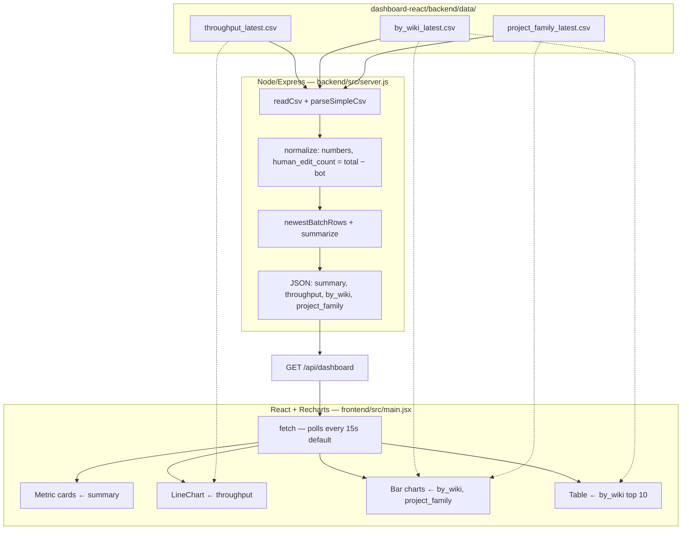

# Hive → React charts data path

How aggregated Hive rows become chart data in the dashboard. **Aggregation happens in Spark**; export, Node, and React only **move, filter, and display** pre-computed metrics.

For export SQL details see [`hive-dashboard-export.md`](hive-dashboard-export.md). For Spark aggregations see [`spark-streaming-flow.md`](spark-streaming-flow.md).

---

## After Hive export → charts

Upstream (Spark → Hive → `export-hive-dashboard-data.sh`): [`hive-dashboard-export.md`](hive-dashboard-export.md).



**No aggregation here** — Node filters/sorts and picks top rows; React renders pre-computed counts.

**Refresh:** `export-hive-dashboard-loop.sh` updates CSVs ~every 120s; React re-fetches `/api/dashboard` every 15s (`VITE_REFRESH_MS`).

---

## Step 1 — Spark writes Hive (source of chart numbers)

Spark appends rows like:

| Table | Example columns | Chart use later |
|-------|-----------------|-----------------|
| `wiki_pulse_throughput` | `window_start`, `window_end`, `edit_count`, `bot_edit_count`, `batch_written_at` | Line chart + summary cards |
| `wiki_pulse_by_wiki` | `window_start`, `wiki`, `edit_count`, `batch_written_at` | Bar chart + table |
| `wiki_pulse_by_project_family` | `window_start`, `project_family`, `edit_count`, `batch_written_at` | Bonus bar chart |

Each micro-batch adds new snapshot rows; `batch_written_at` is when Spark wrote that batch.

---

## Step 2 — Export: Hive rows → CSV files

`scripts/export-hive-dashboard-data.sh` runs three Hive queries (see [`hive-dashboard-export.md#export-hive-queries`](hive-dashboard-export.md#export-hive-queries-what-the-sql-does)).

**Example:** one line in `throughput_latest.csv` after the script adds the header:

```text
window_start,window_end,edit_count,bot_edit_count,batch_written_at
2026-05-14T12:00:00,2026-05-14T12:05:00,42,3,2026-05-14T12:05:30
```

| CSV file | Hive table |
|----------|------------|
| `dashboard-react/backend/data/throughput_latest.csv` | `wiki_pulse_throughput` |
| `dashboard-react/backend/data/by_wiki_latest.csv` | `wiki_pulse_by_wiki` |
| `dashboard-react/backend/data/project_family_latest.csv` | `wiki_pulse_by_project_family` |

Writes are atomic (`*.csv.tmp` then rename). If CSVs are missing, the API falls back to `sample-data/*.csv`.

---

## Step 3 — Node API: CSV → JSON

**File:** `dashboard-react/backend/src/server.js`  
**Entry:** `loadDashboardData()` (used by `GET /api/dashboard`)

### 3a. Read and parse CSV

```javascript
readCsv("throughput_latest.csv", "wiki_pulse_throughput_sample.csv")
parseSimpleCsv(text)  // header row → object keys, one object per data line
```

### 3b. Normalize types (not re-aggregation)

| Function | Input | Output change |
|----------|--------|----------------|
| `normalizeThroughput` | CSV row | Numbers; adds `human_edit_count = edit_count - bot_edit_count` |
| `normalizeByWiki` | CSV row | Coerce `edit_count` to number |
| `normalizeProjectFamily` | CSV row | Coerce `edit_count` to number |

### 3c. Shape data for charts

| Dataset | Node logic | Purpose |
|---------|------------|---------|
| `throughput` | Sort by `window_start` ascending | Line chart x-axis order |
| `by_wiki` | `newestBatchRows()` — keep only rows with max `batch_written_at`, sort by `edit_count` desc | Bar chart = latest Spark batch only |
| `project_family` | Same as `by_wiki` | Bonus bar chart |
| `summary` | `summarize()` — latest throughput row + first wiki/family row; compute bot % | Top metric cards |

`newestBatchRows` and `summarize` **filter and pick** rows; they do **not** sum events across wikis or re-window time.

### 3d. JSON response shape

`GET http://localhost:4000/api/dashboard` returns:

```json
{
  "generated_at": "2026-05-14T12:10:00.000Z",
  "data_dir": ".../dashboard-react/backend/data",
  "sources": {
    "throughput": { "path": "...", "updated_at": "...", "using_fallback": false },
    "by_wiki": { ... },
    "project_family": { ... }
  },
  "summary": {
    "latest_window_start": "2026-05-14T12:00:00",
    "latest_window_end": "2026-05-14T12:05:00",
    "latest_edit_count": 42,
    "latest_bot_edit_count": 3,
    "latest_human_edit_count": 39,
    "latest_bot_percentage": 7.1,
    "top_wiki": "enwiki",
    "top_wiki_edit_count": 18,
    "top_project_family": "Wikipedia",
    "top_project_family_edit_count": 25
  },
  "throughput": [ { "window_start", "window_end", "edit_count", "bot_edit_count", "human_edit_count", "batch_written_at" }, ... ],
  "by_wiki": [ { "window_start", "window_end", "wiki", "edit_count", "batch_written_at" }, ... ],
  "project_family": [ { "window_start", "window_end", "project_family", "edit_count", "batch_written_at" }, ... ]
}
```

Other routes: `/api/throughput`, `/api/top-wikis`, `/api/project-families` return subsets of the same data.

---

## Step 4 — React: JSON → chart props

**File:** `dashboard-react/frontend/src/main.jsx`  
**Fetch:** `GET ${VITE_API_BASE_URL}/api/dashboard` every `VITE_REFRESH_MS` (default 15s)

| UI block | JSON field | Recharts mapping |
|----------|------------|------------------|
| Metric cards | `summary.*` | Formatted numbers/strings (no chart lib) |
| Throughput line chart | `throughput` → `chartThroughput` (add `label` from `window_start`) | `<LineChart data={chartThroughput}>` — `dataKey="edit_count"`, `dataKey="bot_edit_count"`, `XAxis dataKey="label"` |
| Top wikis bar chart | `by_wiki.slice(0, 15)` | `<BarChart>` — `YAxis dataKey="wiki"`, `Bar dataKey="edit_count"` |
| Project families bar chart | `project_family.slice(0, 12)` | `<BarChart>` — `XAxis dataKey="project_family"`, `Bar dataKey="edit_count"` |
| Wiki table | `by_wiki.slice(0, 10)` | Plain HTML table |

React does **not** aggregate; it only formats times/numbers and passes arrays to Recharts.

---

## Where aggregation happens

| Layer | Aggregates event streams? |
|-------|---------------------------|
| Spark | **Yes** — windows, counts, group by wiki / project family |
| Hive export SQL | **No** — `SELECT` + `LIMIT` only |
| Node API | **No** — parse, filter latest batch, derive human count & bot % |
| React | **No** — render pre-aggregated values |

---

## Run order for live charts

```bash
bash scripts/run-producer-docker.sh          # Terminal 1
bash scripts/run-spark-streaming-hive.sh     # Terminal 2 — fills Hive
bash scripts/export-hive-dashboard-loop.sh   # Terminal 3 — Hive → CSV
cd dashboard-react/backend && npm run dev  # Terminal 4 — CSV → JSON
cd dashboard-react/frontend && npm run dev # Terminal 5 — JSON → charts
```

Open http://localhost:5173. Charts update when (1) Spark writes new Hive rows, (2) export refreshes CSVs, (3) React polls the API.

**Verify API payload:**

```bash
curl -s http://localhost:4000/api/dashboard | head -c 500
ls -la dashboard-react/backend/data/
```

---

## Related documentation

| Topic | Document |
|-------|----------|
| Export SQL | [`hive-dashboard-export.md`](hive-dashboard-export.md) |
| Dashboard run order | [`dashboard-react/README.md`](../dashboard-react/README.md) |
| Hive table schemas | [`sink-spec.md`](sink-spec.md) |
| Spark aggregations | [`spark-streaming-flow.md`](spark-streaming-flow.md) |
