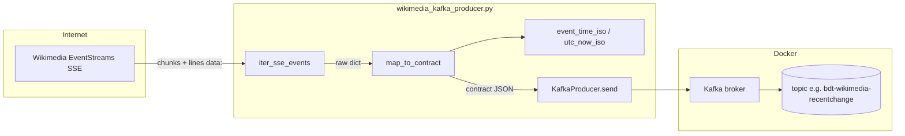

# `wikimedia_kafka_producer.py` — reference

Python producer that reads **Wikimedia EventStreams** (HTTP **SSE**) and publishes **JSON** messages to Kafka according to **`kafka-message-contract.md`**.

**Run:** `python producer/wikimedia_kafka_producer.py`  
**Dependencies:** `producer/requirements.txt` (`kafka-python`, `python-dotenv`)

---

## Flow (high level)

**Reconnect loop (`run`):** if the HTTP stream drops or Kafka errors, the outer loop sleeps with **exponential backoff**, rebuilds the producer if needed, and opens a **new** SSE connection.

---

## Module constants

| Name | Purpose |
|------|---------|
| `DEFAULT_STREAM_URL` | Default Wikimedia `recentchange` SSE endpoint |
| `SOURCE_TAG` | Written into every message as `source` (contract constant) |
| `SCHEMA_VERSION` | Written as `schema_version` (`1.0`) |
| `COMMENT_MAX_LEN` | Long edit summaries truncated to avoid oversized Kafka values |
| `log` | Logger instance (`wikimedia_kafka_producer`) |

Environment is loaded with **`load_dotenv()`** so `.env` can set `KAFKA_BOOTSTRAP_SERVERS`, `KAFKA_TOPIC_RAW`, `EVENTSTREAMS_URL`.

---

## Functions

### `utc_now_iso() -> str`

Returns **current UTC time** as ISO-8601 string with milliseconds and **`Z`** suffix.

**Used for:** `ingest_time` on every outbound message; fallback **event time** when the upstream event has no usable timestamp.

---

### `event_time_iso(ev: Dict[str, Any]) -> str`

Derives **event time** (for Spark watermarks / windows) from one raw Wikimedia JSON object:

1. Prefer **`meta.dt`** string if present (normalize to ISO Z).
2. Else **`timestamp`** as Unix number or digit string → convert to UTC ISO.
3. Else **`utc_now_iso()`**.

---

### `map_to_contract(raw: Dict[str, Any]) -> Dict[str, Any]`

Maps **one** raw EventStreams dictionary to the **Kafka JSON contract**:

| Output field | Typical source in `raw` |
|--------------|-------------------------|
| `wiki` | `meta.domain` |
| `title`, `namespace`, `type`, `user`, `bot`, `minor`, `comment` | top-level keys |
| `meta_uri` | `meta.uri` |
| `event_time` | via `event_time_iso(raw)` |
| `ingest_time` | `utc_now_iso()` |
| `source`, `schema_version` | module constants |

Missing or invalid fields get safe defaults (`wiki="unknown"`, `namespace_id=0`, etc.). Long **`comment`** strings are truncated to **`COMMENT_MAX_LEN`**.

---

### `iter_sse_events(stream_url: str) -> Iterator[Dict[str, Any]]`

Opens **`stream_url`** with **`urllib`** (`Accept: text/event-stream`), reads the body in **8 KiB chunks**, splits on newlines, and parses **SSE** lines:

- Ignores lines that do not start with **`data:`**.
- Skips empty payloads and **`[DONE]`**.
- **`json.loads`** the payload; skips invalid JSON.
- **`yield`** each decoded object that is a **`dict`**.

Stops when the HTTP stream ends (`read()` returns empty); connection errors are **not** caught here—they propagate to **`run`**.

---

### `make_producer(bootstrap: str) -> KafkaProducer`

Builds a **`kafka-python`** `KafkaProducer`:

| Setting | Role |
|---------|------|
| `bootstrap_servers` | Comma-separated list from `bootstrap` |
| `key_serializer` | UTF-8 encode of partition key (wiki domain) |
| `value_serializer` | JSON (compact) → UTF-8 bytes |
| `acks='all'` | Wait for all in-sync replicas before ack |
| `retries`, `request_timeout_ms`, `linger_ms` | Reliability / small batching |

---

### `run(stream_url, topic, bootstrap, limit: Optional[int]) -> int`

Main **control loop**:

1. **Connect to Kafka** (`make_producer`); on **`KafkaError`**, backoff and retry.
2. **Iterate** `iter_sse_events(stream_url)`:
   - **`map_to_contract`** each event.
   - **`producer.send(topic, key=wiki, value=msg)`** then **`future.get(timeout=30)`** so failures surface quickly.
   - Optional **`--limit`**: after **N** successful sends, **flush**, return **`0`**.
   - Every **500** messages, log progress.
3. On **HTTPError**, **URLError**, **KafkaError**, or other exceptions: log, **flush/close** producer, **sleep** with exponential backoff (cap **60 s**), outer **`while True`** retries.

Returns **`0`** on normal completion (`limit` reached). Loops forever if **`limit`** is **`None`** unless the process is stopped.

---

### `main() -> int`

CLI entry point:

- Parses **`--limit`** and **`--stream-url`** (default from env or `DEFAULT_STREAM_URL`).
- Reads **`KAFKA_BOOTSTRAP_SERVERS`** and **`KAFKA_TOPIC_RAW`** from the environment; exits **`1`** if either is missing.
- Calls **`run(...)`** and returns its exit code.

---

## CLI / environment

| Variable / flag | Meaning |
|-----------------|--------|
| `KAFKA_BOOTSTRAP_SERVERS` | Required. E.g. `kafka-server:9092` |
| `KAFKA_TOPIC_RAW` | Required. E.g. `bdt-wikimedia-recentchange` |
| `EVENTSTREAMS_URL` | Optional override for SSE URL |
| `--limit N` | Publish **N** messages then exit (testing) |
| `--stream-url URL` | Override EventStreams URL for one run |

---

## Running with Docker (no local Python 3.11)

Two helper scripts attach a **`python:3.11-slim-bookworm`** container to the **same Docker network** as **`kafka-server`** (hostname **`kafka-server:9092`** works inside that network; no Windows hosts file needed).

| Script | Purpose |
|--------|---------|
| **`scripts/verify-producer.sh`** `[N]` | Smoke test: publishes **`N`** messages (default **5**), then runs **`kafka-console-consumer`** for **`N`** lines. Always passes **`--limit`**. |
| **`scripts/run-producer-docker.sh`** `[N]` | Continuous run: **omit** `N` to stream until **Ctrl+C**; optional **`N`** same as **`--limit`** for short tests. |

**Configuration inside the container**

- The repo is mounted at **`/app`** with **`-w /app`**. This module calls **`load_dotenv()`** at import time, which loads **`.env`** from the **current working directory** — i.e. **`/app/.env`** when you run from the project root in Docker.
- **`scripts/run-producer-docker.sh`** does **not** use Docker’s **`--env-file`** with a host path. Passing a host **`.env`** path through **`docker --env-file`** can fail on **Docker Desktop for Windows** when the path contains **spaces**. Loading via **`load_dotenv()`** avoids that.
- If **`.env`** is missing at the repo root, **`run-producer-docker.sh`** injects default **`-e`** variables (**`KAFKA_BOOTSTRAP_SERVERS`**, **`KAFKA_TOPIC_RAW`**, **`EVENTSTREAMS_URL`**) so the producer still starts.

---

## Related documentation

- **`docs/kafka-message-contract.md`** — field definitions consumed downstream  
- **`README.md`** — Phase 2: host run, **`verify-producer.sh`**, **`run-producer-docker.sh`**
