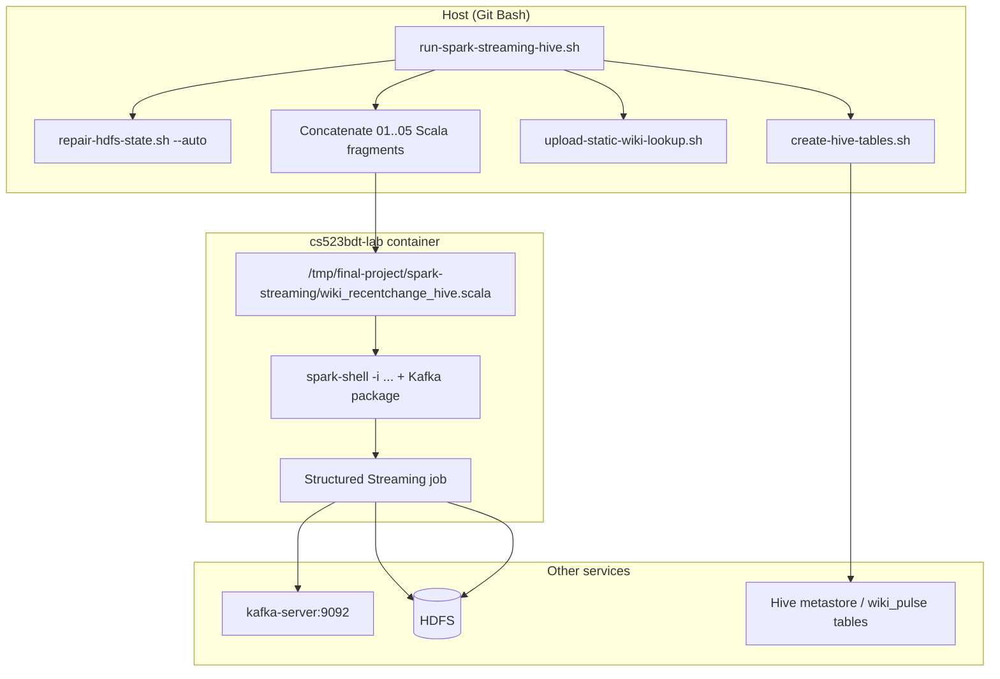

# How `scripts/run-spark-streaming-hive.sh` works

This document describes what happens when you run:

```bash
bash scripts/run-spark-streaming-hive.sh
```

## Purpose

The script starts the **Phase 4** Spark Structured Streaming job inside the course lab container (`cs523bdt-lab`). The job:

1. Reads JSON events from Kafka topic `bdt-wikimedia-recentchange`
2. Parses and aggregates them in event-time windows
3. Joins a static wiki lookup CSV from HDFS (bonus)
4. Appends Parquet files to the Hive warehouse paths for three summary tables

It does **not** start the Wikimedia producer or the dashboard. Run the producer separately (`bash scripts/run-producer-docker.sh`) so Kafka has data.

## High-level flow



## Step-by-step (what the shell script does)

### 1. Host setup

| Step | Code behavior |
|------|----------------|
| Strict mode | `set -euo pipefail` — exit on error, unset variables, pipe failures |
| Path fix (Windows Git Bash) | `scripts/lib/common.sh` sets `MSYS_NO_PATHCONV` when needed; no change on macOS/Linux |
| Project root | `cd` to repo root (parent of `scripts/`) |
| Optional `.env` | If `.env` exists, `source` it so `KAFKA_*`, `SPARK_*`, `HIVE_*` overrides apply |

### 2. Preconditions

Fails fast if these Docker containers are missing:

- `cs523bdt-lab` — runs Spark and Hive CLI
- `kafka-server` — Kafka broker the job reads from

### 3. Validate Scala fragments

Expects five files under `spark-streaming/wiki_recentchange_hive/`:

| Order | File |
|-------|------|
| 1 | `01_imports_config.scala` |
| 2 | `02_lookup.scala` |
| 3 | `03_kafka_parse.scala` |
| 4 | `04_aggregates.scala` |
| 5 | `05_writes.scala` |

If any file is missing, the script exits with an error.

### 4. Resolve configuration (defaults + env)

Variables are set with `${VAR:-default}` unless already exported or set in `.env`:

| Variable | Default | Role |
|----------|---------|------|
| `KAFKA_BOOTSTRAP_SERVERS` | `kafka-server:9092` | Kafka broker (Docker network hostname) |
| `KAFKA_TOPIC_RAW` | `bdt-wikimedia-recentchange` | Topic to subscribe |
| `SPARK_STARTING_OFFSETS` | `latest` | `latest` = only new messages after start; use `earliest` to replay |
| `SPARK_CHECKPOINT_DIR` | `hdfs://localhost:9000/tmp/wiki-pulse/checkpoints/hive` | Streaming state + Kafka offsets |
| `SPARK_WINDOW_DURATION` | `5 minutes` | Event-time tumbling window size |
| `SPARK_WATERMARK_DELAY` | `10 minutes` | How late events may arrive |
| `SPARK_TRIGGER_INTERVAL` | `30 seconds` | Micro-batch interval |
| `SPARK_SHUFFLE_PARTITIONS` | `4` | Shuffle parallelism for aggregations |
| `HIVE_DATABASE` | `wiki_pulse` | Hive database name |
| `HIVE_THROUGHPUT_PATH` | `.../wiki_pulse_throughput` | HDFS dir for throughput Parquet |
| `HIVE_BY_WIKI_PATH` | `.../wiki_pulse_by_wiki` | HDFS dir for per-wiki Parquet |
| `HIVE_BY_PROJECT_FAMILY_PATH` | `.../wiki_pulse_by_project_family` | HDFS dir for project-family Parquet |
| `STATIC_WIKI_LOOKUP_PATH` | `hdfs://.../wiki_project_lookup.csv` | Bonus static CSV on HDFS |
| `SPARK_KAFKA_PACKAGE` | `org.apache.spark:spark-sql-kafka-0-10_2.12:3.1.2` | Maven coord for Kafka source in `spark-shell` |
| `SKIP_HDFS_REPAIR_CHECK` | `0` | Set to `1` to skip auto HDFS repair |

### 5. HDFS repair (optional but default)

Unless `SKIP_HDFS_REPAIR_CHECK=1`:

```bash
bash scripts/repair-hdfs-state.sh --auto
```

- Leaves HDFS safe mode
- Runs `hdfs fsck` on checkpoint and warehouse paths
- If corrupt/missing blocks are found, drops `wiki_pulse` and deletes generated HDFS paths

### 6. Ensure Hive tables exist

```bash
bash scripts/create-hive-tables.sh
```

- Copies `sql/hive/create_wiki_pulse_tables.sql` into the container
- Runs `hive -f` to create database `wiki_pulse` and three Parquet tables
- Table **locations** must match the `HIVE_*_PATH` values Spark writes to

### 7. Ensure static lookup on HDFS

```bash
bash scripts/upload-static-wiki-lookup.sh
```

- Copies `static-data/wiki_project_lookup.csv` into the lab container
- `hdfs dfs -put` to `/tmp/wiki-pulse/static/wiki_project_lookup.csv`

### 8. Assemble and copy the Spark job

On the host, fragments are concatenated in order and piped into the container:

```bash
cat 01_imports_config.scala 02_lookup.scala ... 05_writes.scala \
  | docker exec -i cs523bdt-lab ... > /tmp/final-project/spark-streaming/wiki_recentchange_hive.scala
```

`spark-shell` only accepts **one** init file (`-i`); splitting source in Git does not change runtime — it is still one combined script inside the container.

### 9. Start `spark-shell` (blocks until Ctrl+C)

```bash
docker exec -it cs523bdt-lab bash -lc \
  "spark-shell --master local[2] \
   --packages org.apache.spark:spark-sql-kafka-0-10_2.12:3.1.2 \
   --conf spark.sql.session.timeZone=UTC \
   -i /tmp/final-project/spark-streaming/wiki_recentchange_hive.scala"
```

- **`local[2]`** — one JVM, two threads (driver + executors in-process)
- **`--packages`** — downloads Kafka connector JARs on first run (can take a minute)
- **`-e VAR=...`** — passes all config into the container environment for `sys.env` in Scala
- **`exec`** — replaces the shell process; when Spark exits, the script exits

The terminal stays attached so you see batch logs and `show()` output.

## What the assembled Scala job does (runtime)

After `spark-shell` loads the combined file:

### Fragment 01 — config

- Sets Spark timezone, shuffle partitions, log level
- Reads `sys.env` for Kafka, checkpoint, window, Hive paths
- Prints a startup banner

### Fragment 02 — lookup

- Batch-reads the static CSV from HDFS into `wikiLookup` (deduped by `wiki`)

### Fragment 03 — Kafka + parse + enrich

- Defines JSON schema matching `docs/kafka-message-contract.md`
- `spark.readStream.format("kafka")` on the topic
- Parses `value` as JSON, filters `schema_version = 1.0`, builds `event_ts`
- Watermark on `event_ts`
- Left join `broadcast(wikiLookup)` on `wiki` → `enrichedEvents`

### Fragment 04 — aggregates

Three streaming DataFrames (5-minute windows by default):

- `throughput` — `edit_count`, `bot_edit_count` per window
- `byWiki` — `edit_count` per window + `wiki`
- `byProjectFamily` — `edit_count` per window + `project_family`

### Fragment 05 — writes

- `writeHiveSnapshot` — adds `batch_written_at`, writes **append** Parquet to the Hive table HDFS path
- Three `writeStream` queries with:
  - `outputMode("update")`
  - separate `checkpointLocation` under `.../checkpoints/hive/{throughput,by-wiki,by-project-family}`
  - `trigger(ProcessingTime(30 seconds))`
  - `foreachBatch` → Parquet append
- `spark.streams.awaitAnyTermination()` — keeps the job alive

## Data paths (where files land)

| Logical table | Default HDFS warehouse path |
|---------------|----------------------------|
| `wiki_pulse.wiki_pulse_throughput` | `/user/hive/warehouse/wiki_pulse.db/wiki_pulse_throughput` |
| `wiki_pulse.wiki_pulse_by_wiki` | `/user/hive/warehouse/wiki_pulse.db/wiki_pulse_by_wiki` |
| `wiki_pulse.wiki_pulse_by_project_family` | `/user/hive/warehouse/wiki_pulse.db/wiki_pulse_by_project_family` |

Checkpoints (not queried by Hive):

```text
/tmp/wiki-pulse/checkpoints/hive/throughput
/tmp/wiki-pulse/checkpoints/hive/by-wiki
/tmp/wiki-pulse/checkpoints/hive/by-project-family
```

## Dependencies and run order

Recommended order:

```text
1. Course Docker stack up
2. bash scripts/create-project-topic.sh      (once)
3. bash scripts/run-producer-docker.sh       (Terminal 1 — keeps running)
4. bash scripts/run-spark-streaming-hive.sh  (Terminal 2 — this script)
5. bash scripts/export-hive-dashboard-data.sh (loop for dashboard)
```

Or use `bash scripts/start.sh` to run steps 2–5 in the background.

## Stopping the job

- **Ctrl+C** in the terminal running this script
- Or `bash scripts/stop-everything.sh` to kill wrappers and Spark inside the lab container

## Troubleshooting

| Symptom | Likely cause | Action |
|---------|----------------|--------|
| No rows in Hive | Producer not running or `SPARK_STARTING_OFFSETS=latest` started before producer | Start producer; or reset checkpoints and use `SPARK_STARTING_OFFSETS=earliest` |
| `BlockMissingException` | Stale/corrupt HDFS after container restart | `bash scripts/repair-hdfs-state.sh --reset` then recreate Hive tables and rerun |
| First run very slow | `--packages` downloading Kafka JARs | Wait; subsequent runs are faster |
| `create-hive-tables` runs every time | By design — idempotent `CREATE TABLE IF NOT EXISTS` | Safe to ignore unless you need a clean warehouse |

## Related files

| File | Role |
|------|------|
| `scripts/run-spark-streaming-hive.sh` | This launcher |
| `scripts/repair-hdfs-state.sh` | HDFS/Hive reset before Spark |
| `scripts/create-hive-tables.sh` | Hive DDL |
| `scripts/upload-static-wiki-lookup.sh` | Static CSV to HDFS |
| `spark-streaming/wiki_recentchange_hive/*.scala` | Job source fragments |
| `sql/hive/create_wiki_pulse_tables.sql` | Hive table definitions |
| `docs/kafka-message-contract.md` | JSON schema the Spark job expects |
